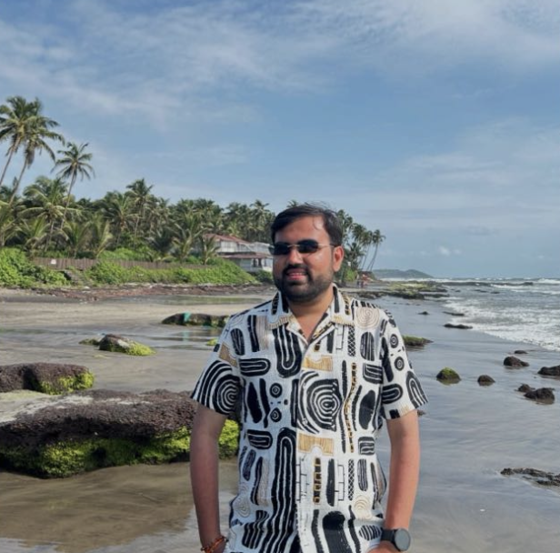
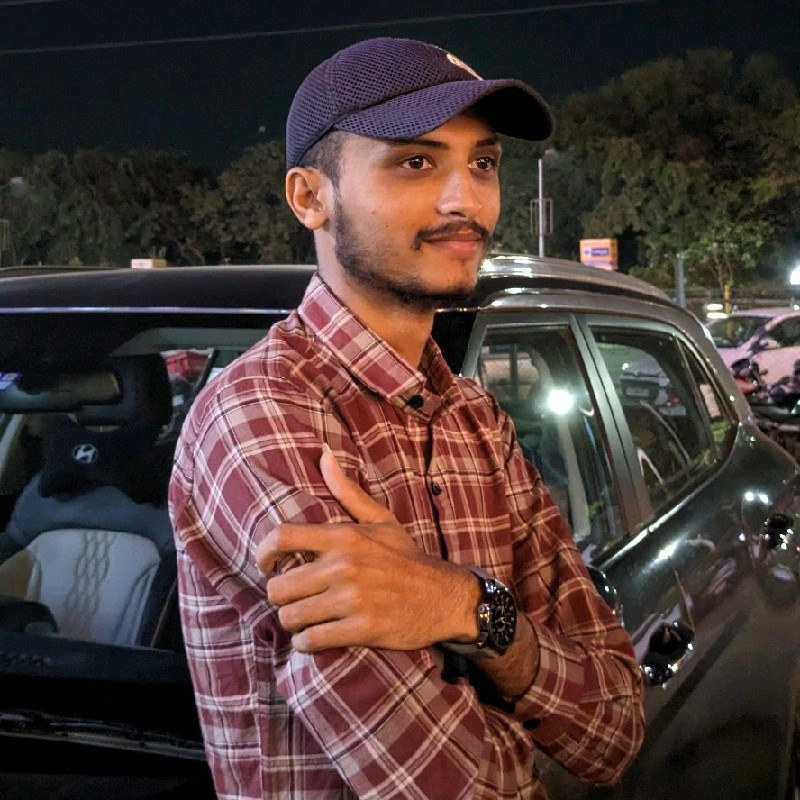
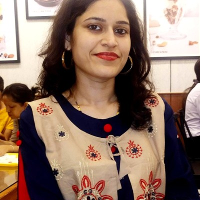

# Project Team

| { width=180px style="border-radius:9999px;" }   **Rahul Singh**   *CTO*   🔗 [LinkedIn](https://www.linkedin.com/in/rahul-bains/)   🔗 [GitHub](https://github.com/rahuluniv) | As a CTO and experienced software consultant, I drive strategic technological innovation while aligning business objectives with cutting-edge solutions. At WareMatch, I lead the entire technology spectrum—from conceptualization and design of scalable, secure, and reliable architectures to hands-on software development. My responsibilities extend beyond coding and system design; I set the technical vision and roadmap that steer the company toward long-term growth. |
| :------------------------------------------------------------------------------------------------------------------------------------------------------------------------------------------------------------------: | :---------------------------------------------------------------------------------------------------------------------------------------------------------------------------------------------------------------------------------------------------------------------------------------------------------------------------------------------------------------------------------------------------------------------------------------------------------------------------------- |

---

| { width=180px style="border-radius:9999px;" }   **Malhar Patel**   *Technical Lead / Solution Architect*   🔗 [LinkedIn](https://www.linkedin.com/in/malhar-patel-7575441a9/)   🔗 [GitHub](https://github.com/malhar2000) | As a Technical Lead and Solution Architect, I specialize in designing and implementing robust backend systems using .NET Core and Go. I have extensive experience in building microservices, developing APIs, and integrating with cloud platforms such as Azure and AWS. My expertise spans SQL Server, PostgreSQL, and Redis, and I’m passionate about improving performance, scalability, and system reliability through thoughtful architecture and automation. |
| :-----------------------------------------------------------------------------------------------------------------------------------------------------------------------------------------------------------------------------------------------------------------: | :------------------------------------------------------------------------------------------------------------------------------------------------------------------------------------------------------------------------------------------------------------------------------------------------------------------------------------------------------------------------------------------------------------------------------------------------------------------ |

---

| { width=180px style="border-radius:9999px;" }   **Gaurang Ganatra**   *Software Engineer*   🔗 [LinkedIn](https://www.linkedin.com/in/gaurang-ganatra/)   🔗 [GitHub](https://github.com/gaurang-ganatra) | A highly skilled **Senior Software Engineer** with strong expertise in **Node.js, TypeScript, PHP, Laravel, and Vue.js**, Gaurang has a proven record of delivering scalable and high performing web applications. With hands-on experience across all stages of the software lifecycle from planning and architecture to deployment and maintenance. he excels at building efficient APIs, optimizing workflows and integrating cloud-based services using **AWS**.    **Key Skills:** Node.js, TypeScript, PHP, Laravel, Vue.js, JavaScript, HTML, CSS, AWS Lambda, MySQL, Kubernetes, GitLab, Nginx, Apache
| :-----------------------------------------------------------------------------------------------------------------------------------: | :--------------------------------------------------------------------------------------------------------------------------------------------------------------------------------------------------------------------------------------------------------------------------------------------------------------------------------------------------------------------------------------------------------------------------------------------------------------------------------------------------------------------------------------------------------------------------------------------------------------------------------------------------------------------------------------------------------------------------------------------------------------------------------------------------------------------------------------------------------------------------------------------------------------------------------------------------------------------------------------------------------------------------------------------------------------------------------------------------------------------------------------------------------------------------------------------------------------------------------------------------------------------------------------------------------------------------------------------------------------------------------------------------------------------------------------------------------------------------------------------------------------------------------------------------------------------------------------------------------------------------------------------------------------------------------------------------------- |

---

| { width=180px style="border-radius:9999px;" }   **Parimal**   Backend Developer   🔗 [LinkedIn](https://www.linkedin.com/in/parimal-tank-b9aa761aa/)   🔗 [GitHub](https://github.com/ParimalTank) | A **skilled Backend Developer** with over **4 years of experience** building robust, scalable server-side applications and APIs for web and mobile platforms. Parimal specializes in **Node.js, Express, and Python**, with a strong background in designing RESTful APIs, integrating databases, and optimizing backend performance. He is adept at working with **SQL and NoSQL databases**, implementing authentication, and deploying cloud-based solutions. Parimal collaborates closely with frontend and DevOps teams to deliver secure, efficient, and maintainable systems.   **Key Skills:** Node.js, Express, Python, REST APIs, PostgreSQL, MongoDB, Redis, Docker, AWS, CI/CD, Authentication & Authorization, Microservices Architecture, Git  
| :------------------------------------------------------------------------------------------------------------------: | :---------------------------------------------------------------------------------------------------------------------------------------------------------------------------------------------------------------------------------------------------------------------------------------------------------------------------------------------------------------------------------------------------------------------------------------------------------------------------------------------------------------------------------------------------------------------------------------------------------------------------------------------------------------------------------------------------------------------------------------------------------------------------------------------------------------------------------------------------------- |

---

| { width=180px style="border-radius:9999px;" }   **Ankit**   *Frontend Developer*   🔗 [LinkedIn](https://www.linkedin.com/in/ankit-pithiya-207b25151/)   🔗 [GitHub](https://github.com/Pithiya25)| A **skilled Frontend Developer** with over **3 years of experience** building responsive and interactive web applications. Ankit specializes in **modern JavaScript frameworks**, with strong expertise in **HTML5, CSS3, and JavaScript**. He is adept at translating UI/UX designs into high-quality code, optimizing performance, and ensuring cross-browser compatibility. Ankit collaborates effectively with designers and backend teams to deliver seamless user experiences.   **Key Skills:** JavaScript, HTML5, CSS3, React, Next, Vue.js, Bootstrap 5, Responsive Design, Figma, Git, Webpack, REST APIs  
| :------------------------------------------------------------------------------------------------------------------: | :---------------------------------------------------------------------------------------------------------------------------------------------------------------------------------------------------------------------------------------------------------------------------------------------------------------------------------------------------------------------------------------------------------------------------------------------------------------------------------------------------------------------------------------------------------------------------------------------------------------------------------------------------------------------------------------------------------------------------------------------------------------------------------------------------------------------------------------------------------- |

---

| { width=180px style="border-radius:9999px;" }   **Sarthak Rakholiya**   *Frontend Developer*   🔗 [LinkedIn](https://www.linkedin.com/in/sarthak-rakholiya/)   🔗 [GitHub](https://github.com/sarthakRakholiya) | A **Frontend Developer** (He/Him) with **3.5+ years of experience** building clean, fast, and scalable web apps—primarily using **React.js** and **Next.js**. Sarthak has delivered production-ready applications across domains, focusing on performance, pixel-perfect UI, and maintainable code. Notable achievements include boosting SEO and performance by ~30% with Next.js SSR, building real-time scheduling logic, and reducing manual QA by 40% through E2E tests with Playwright & Cucumber. He excels at delivering responsive admin dashboards and integrating REST APIs.  **Key Skills:** React.js, Next.js, TypeScript, Redux Toolkit, Tailwind CSS, Playwright, PWA Concepts, Responsive Design, REST APIs 
| :------------------------------------------------------------------------------------------------------------------: | :---------------------------------------------------------------------------------------------------------------------------------------------------------------------------------------------------------------------------------------------------------------------------------------------------------------------------------------------------------------------------------------------------------------------------------------------------------------------------------------------------------------------------------------------------------------------------------------------------------------------------------------------------------------------------------------------------------------------------------------------------------------------------------------------------------------------------------------------------------- |

---

| { width=180px style="border-radius:9999px;" }   **Prajakta**   *UX Developer*   🔗 [LinkedIn](https://www.linkedin.com/in/prajakta-dhande-8709531b7/)| A **user-focused UX Developer** with over **4 years of experience** designing intuitive, user-centered digital experiences across web and mobile platforms. Prajakta is skilled in **user research, wireframing, prototyping, and responsive design**, with strong command of tools like **Figma, Photoshop, and Spline 3D**. She collaborates closely with cross-functional teams to ensure usability, accessibility, and aesthetic balance in every project.    **Key Skills:** User Research, Usability Testing, Wireframing, Prototyping, Accessibility Design, Figma, Photoshop, Canva, Spline 3D, HTML5, CSS3, JavaScript, Bootstrap 5  
| :------------------------------------------------------------------------------------------------------------------: | :---------------------------------------------------------------------------------------------------------------------------------------------------------------------------------------------------------------------------------------------------------------------------------------------------------------------------------------------------------------------------------------------------------------------------------------------------------------------------------------------------------------------------------------------------------------------------------------------------------------------------------------------------------------------------------------------------------------------------------------------------------------------------------------------------------------------------------------------------------- |

---

| { width=180px style="border-radius:9999px;" }   **Rashmi Ranjan**   *Software Test Engineer*   🔗 [LinkedIn](https://www.linkedin.com/in/rashmi-ranjan-0437bbb4/)   | A **dedicated QA professional** with **5+ years of experience** in functional, integration, regression, and performance testing across publishing, e-commerce, telecom, and food delivery domains. Rashmi excels in ensuring software reliability through detailed **test case design, execution, and defect tracking** using tools like **JIRA, Bugzilla, Postman, and Selenium**. She is well-versed in SDLC and Agile methodologies, with strong collaboration skills that bridge the gap between development and quality assurance.    **Key Skills:** Manual & Automation Testing, Selenium WebDriver, TestNG, Maven, Postman API Testing, JIRA, Bugzilla, HTML, CSS, SDLC & Agile Processes  
| :-----------------------------------------------------------------------------------------------------------------------------: | :------------------------------------------------------------------------------------------------------------------------------------------------------------------------------------------------------------------------------------------------------------------------------------------------------------------------------------------------------------------------------------------------------------------------------------------------------------------------------------------------------------------------------------------------------------------------------------------------------------------------------------------------------------------------------------------------------------------------------------------------------------------------------------------------------------------------------------------------------------------------------------ |

---

