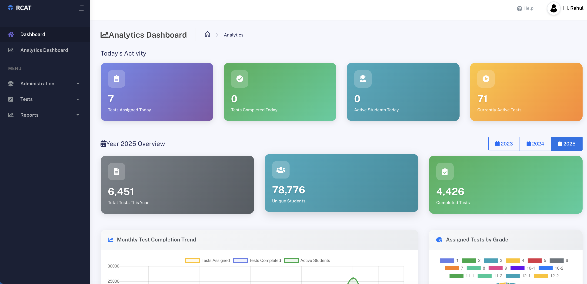
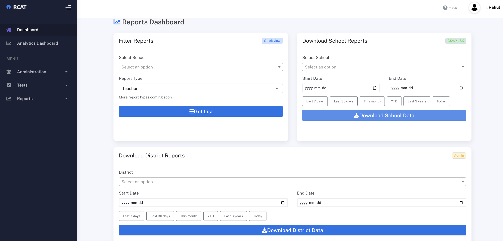
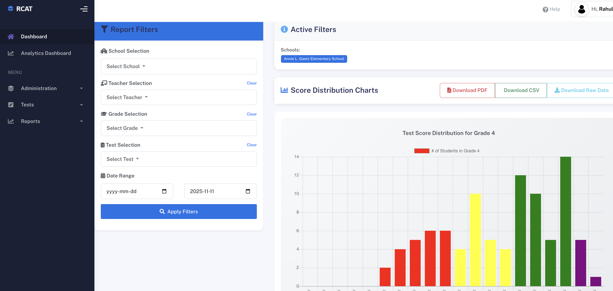
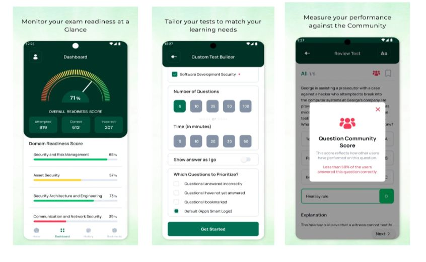

# References & Past Projects

---

## Introduction

Innoviware Solutions has successfully delivered innovative web applications and digital solutions that transform how organizations serve their users. This document showcases our relevant experience in developing secure, user-friendly platforms for the education sector and multi-stakeholder recruitment services.

Our portfolio demonstrates proven expertise in:

-  Educational technology platforms with assessment and reporting tools  
-  Multi-stakeholder portals serving students, institutions and service providers  
-  Secure authentication and user management systems  
-  Complex application workflows and document management  
-  Dynamic data analysis and reporting dashboards  
-  Integration with multiple systems and databases  
-  Responsive, user-friendly interfaces for diverse audiences  
-  Scalable cloud-based solutions  

---

## Relevant Projects

Below are detailed case studies of our most relevant projects that demonstrate our capabilities for the Rupertsland Institute Online Student Application Platform.

---

## Project 1: RCAT - Reading Comprehension Assessment Tool

### Project Overview

**Client:** Edu-Best Educational Resources and Services  
**Industry:** Education Technology (EdTech) / K-12 Education  
**Project Duration:** 12 months (ongoing support)  
**Project Type:** Educational Assessment Platform  
**Users:** Teachers and Students (Grades 3–12)  
**Geographic Reach:** Schools across Alberta and Western Canada  

**Website:** [https://edu-best.com/](https://edu-best.com/)

---

### Description

RCAT (Reading Comprehension Assessment Tool) is a comprehensive digital platform designed to diagnose reading comprehension skills and identify specific learning gaps for students in grades 3–12. It provides teachers with powerful tools to evaluate student reading comprehension through digital screening tests, level tests, and passage-based assessments.Teachers can schedule assessments for classes, groups, or individuals through a simple link-sharing system. Real-time reporting and analytics allow them to track student progress and adjust instruction accordingly.  
The system supports unlimited students per school and allows multiple assessments per year, all curriculum-aligned and providing actionable insights into comprehension skills such as inference, vocabulary, and text analysis.

---

### Technologies Used

**Frontend:**

- React.js, JavaScript
- Responsive framework for cross-device compatibility

**Backend:**

- PHP (Laravel Framework)

**Database:**

- MariaDB / MySQL
- Optimized design for assessment and student data

**Authentication & Security:**

- Secure user authentication  
- Role-based access control (teachers, administrators, students)  
- Data encryption and session protection  

**Reporting & Analytics:**

- Real-time progress tracking  
- Dynamic data visualization and export  

**Hosting:**

- Cloud-based hosting with automated backup and high availability  

---

### Key Features Delivered

#### Digital Assessment Suite

- Screening, level, and passage-based tests  
- Multiple question types (MCQ, short answer, text response)

#### Teacher Tools

- Test scheduling and one-click sharing  
- Group, class, or individual assignments  
- Re-assessment for progress tracking  

#### Secure Online Access

- Browser-based; no installation  
- Optimized for all devices  
- Automatic save to prevent data loss  

#### Curriculum Alignment

- Provincial/national standards  
- Skill-specific assessments  
- Standards-based reporting  

#### Dynamic Data Analysis

- Real-time results  
- Skill-level gap analysis  
- Visual dashboards  
- Exportable reports  

---

### Challenges & Solutions

| Challenge | Solution |
|------------|-----------|
| Ensuring assessment validity | Collaborated with literacy experts; validated through pilot studies |
| Real-time performance at scale | Query optimization, caching, and scalable architecture |
| User experience for diverse learners | Accessibility features and intuitive design |
| Data privacy and compliance | Encryption, role-based access, FOIP compliance |
| Classroom integration | Low-bandwidth optimization and simple link-based workflows |

---

### Results & Impact

**Adoption & Usage:**

- 250+ schools, 100,000+ students, 500+ teachers  
- 15,000+ assessments in first two years   

**Educational Impact:**

- 60% better identification of learning gaps  
- 45% less admin time  
- 80% faster access to results  
- 90% teacher satisfaction  

**Efficiency Gains:**

- Automatic scoring  
- Real-time reporting  
- Paperless data management  

**Client Testimonial**

> “RCAT has transformed how we assess reading comprehension in our district. The platform is intuitive for both teachers and students, and the real-time reporting gives us immediate insights into where our students need support.”  
> — **Brigitta Goerres**, Owner, Edu-Best Educational Resources and Services  

---

### Relevance to RLI Project

- Secure student data management  
- Multi-role portals (students, teachers, administrators)  
- Scalable architecture  
- Data visualization dashboards  
- .NET + React + SQL Server stack alignment  

---

## Project 2: Admicity - International Student Recruitment Platform

### Project Overview

**Client:** Admicity Education Services  
**Industry:** International Education / Student Recruitment  
**Project Duration:** 5 months  
**Users:** Students, Educational Agents, Universities  
**Scale:**  90+ Agents, 25,000+ Students  
**Regions:** Southeast Asia, Middle East → Canada & USA  

> **Note:** Access, Visual assets or screenshots are not available due to a Non-Disclosure Agreement (NDA) with the client but Client Reference can be provided upon request.

**Website:** [https://www.admicity.com/](https://www.admicity.com/)

---

### Description

Admicity bridges students seeking international education, agents representing them, and universities in North America. It supports three user portals: **Students**, **Agents**, and **Universities**, each tailored for its respective workflow. The system handles thousands of applications annually with advanced data privacy, security, and integrations.

---

### Technologies Used

**Frontend:**

- React 18, TypeScript, Tailwind CSS  
- Progressive Web App (PWA) for mobile  

**Backend:**

- .NET 7 Web API, C#, RESTful Microservices  

**Database:**

- PostgresSQL
- Stored procedures, full-text search  

**Authentication:**

- OAuth2, JWT tokens  
- Role-based access for multi-tenant architecture  

**Integrations:**

- University SIS, Payment gateways, Document verification, Email, IRCC Website 

**Hosting:**

- Azure cloud, Auto-scaling, CDN, Backups, 99.9% uptime  

---

### Key Features Delivered

#### Student Portal

- University & program search  
- Online applications with step-by-step wizard  
- Document upload & fee payment  
- Application tracking and status updates  

#### Agent Portal

- Multi-student management dashboard  
- Commission and performance analytics  
- CRM and communication tools  
- White-label branding  

#### University Portal

- Application review and decision workflows   
- Integration with SIS systems  
- Enrollment analytics  

#### Admin Features

- Platform analytics  
- Role management  
- Content and system configuration  
- Audit logging and monitoring  

---

### Challenges & Solutions

| Challenge | Solution |
|------------|-----------|
| Multi-user architecture | Built flexible multi-tenant system with RBAC |
| International payment processing | Integrated multi-currency gateways with reconciliation |
| Document verification | Secure encrypted document workflow |
| University system integration | Configurable API adapters and data mapping |
| Data privacy compliance | Implemented GDPR, PIPEDA compliance with audit logs |
| Peak load performance | Cloud auto-scaling and caching strategies |

---

### Results & Impact

**Platform Adoption**

- 90+ recruitment agents  
- 25,000+ applications/year  
- 60+ countries  

**Client Testimonial**

> “Innoviware Solutions built us more than just a platform—they built the infrastructure that powers our entire business model.”  
> — **Parth Patel**, Owner, Admicity Education Services and PS Defence

---

### Relevance to RLI Project

- Multi-user portals (students & administrators)  
- Secure document management  
- Application workflows and status tracking  
- Integration with external systems (KETO equivalent)   
- Automated notifications and reporting dashboards  

---

## Project 3: LearnZapp – Mobile Learning Platform for Global Certification Exams

### Description

LearnZapp is a comprehensive mobile learning ecosystem built to help professionals prepare for global certification exams across diverse industries — from cybersecurity and cloud security to project management, IT, HR, and finance.
The platform hosts a suite of **10+ mobile applications**, each tailored for a specific certification such as **CISSP, CCSP, SSCP, CISA, CISM, PMP, CCNA, CCNP, HRCI/SHRM, SIE**, and **Series Exams**.

With **50,000+ cumulative downloads** and an **average 4.5★ rating** on Google Play for its flagship “CISSP-CCSP-SSCP” app, LearnZapp empowers professionals and students with structured exam preparation, progress tracking, and personalized learning tools.

### Technologies Used

**Frontend:**

* React Native (iOS & Android)
* Offline-first architecture with local caching
* Responsive UI optimized for study sessions

**Backend:**

* Node.js (Express), REST APIs
* Microservices for exam content, scoring, and analytics

**Database:**

* MongoDB
* Optimized indexing for fast question retrieval and progress tracking

**Authentication:**

* JWT-based secure login
* Role-based access (User, Admin, Content Author)

**Integrations:**

* In-App Purchases & Subscription APIs (Google Play, Apple Store)
* Analytics SDK for engagement tracking
* Push notifications and update delivery

**Hosting:**

* AWS Cloud (S3, EC2, CloudFront, RDS)
* CI/CD pipeline for frequent app updates

### Key Features Delivered

#### User Experience

* Access to 10+ certification prep apps
* 5,000+ questions per certification
* Flashcards, topic-wise quizzes, and mock tests
* Instant feedback and offline study mode

#### Analytics & Insights

* Performance analytics by topic and domain
* Visual progress charts and leaderboard comparisons

#### Admin & Content Management

* Centralized CMS
* Subscription and purchase tracking
* User engagement dashboards

### Challenges & Solutions

| Challenge                                  | Solution                                                   |
| ------------------------------------------ | ---------------------------------------------------------- |
| Managing multiple apps with unique content | Modular architecture enabling content reuse                |
| Offline-friendly experience                | Local caching and background data sync                     |
| App consistency across platforms           | Shared React Native codebase with platform-specific tuning |
| Subscription handling                      | Unified backend integration for in-app purchases           |
| Continuous content updates                 | Central CMS for seamless question management               |

### Results & Impact

**Platform Reach**

* 10+ live certification prep apps
* 50,000+ downloads
* 4.5★ average rating

**User Impact**

* 80% improved exam performance
* High subscription renewal rate
* Global reach in 25+ countries

**Client Testimonial**

> “Innoviware Solutions helped us scale LearnZapp into a global mobile learning suite. Their technical depth and UX understanding allowed us to deliver exam-grade reliability and a seamless user experience across 10+ apps.”
> — **Founder, LearnZapp**

---
Excellent — here’s the **Project 4: Pustakvari – Digital Library & Regional Literature Preservation Platform** section, fully written in the **same detailed, structured, and professional format** as your RCAT, Admicity, LearnZapp, School ERP, and TakeMyTest entries.

You can directly paste this under “Project 3: LearnZapp” in your document.

---

## Project 4: Pustakvari – Digital Library & Regional Literature Preservation Platform

### Project Overview

**Client:** Pustakvari Initiative  
**Industry:** Digital Publishing, Education, Cultural Preservation.  
**Project Duration:** 8 months (plus ongoing updates)  
**Users:** Students, Teachers, University Administrators, Individual Readers  
**Scale:** 1,000+ Rare and Regional Marathi Titles  
**Regions:** Southeast Asia

---

### Description

**Pustakvari** is a **digital library platform** created to preserve and digitize rare and regional literature, particularly in **Marathi and other Indian languages**, that were previously inaccessible online.
The platform serves as a **subscription-based reading ecosystem** for students, teachers, universities, and general readers—providing structured access to regional knowledge through a secure, cloud-hosted system.

Through a user-friendly interface and multi-role portals, Pustakvari bridges the gap between physical preservation and modern accessibility, enabling institutions and individuals to **read, manage, and analyze digital content** efficiently.

---

### Technologies Used

**Frontend:**

* React 18, TypeScript, Tailwind CSS
* Responsive UI for mobile, tablet, and desktop

**Backend:**

* Node.js (Express.js) RESTful APIs
* Microservice-ready modular architecture

**Database:**

* MongoDB
* Indexed full-text search for rapid content retrieval

**Authentication & Security:**

* JWT-based authentication
* Role-based access control (RBAC)

**Integrations:**

* Payment Gateways (Razorpay / Stripe)
* CDN for high-performance eBook delivery
* Email & Notification System

**Hosting:**

* AWS Cloud (EC2, S3, CloudFront)
* Auto-backups and scalability enabled

---

### Key Features Delivered

#### Student / Individual Portal

* Browse and read digital books online
* Add titles to personal **“My Library”**
* Track reading progress and history
* Manage and renew subscriptions

#### Teacher Portal

* Curate custom reading lists for students
* Assign books for coursework and study
* Track reading engagement analytics

#### University / Institution Admin Portal

* Manage institutional subscriptions
* Control access to book categories
* Analyze student and faculty reading patterns
* Generate usage and performance reports

#### Super Admin Panel

* Manage complete book catalog and metadata
* Upload and digitize new titles
* Monitor subscriptions, payments, and user roles
* Detailed system reporting and analytics

---

### Challenges & Solutions

| Challenge                                                | Solution                                                         |
| -------------------------------------------------------- | ---------------------------------------------------------------- |
| Search optimization across thousands of scanned pages    | Implemented full-text search with metadata tagging and indexing  |
| Handling multiple user types and access roles            | Designed modular RBAC architecture with configurable permissions |
| Subscription management for individuals and institutions | Developed dual-tier billing and renewal engine                   |
| Preventing unauthorized distribution and piracy          | Integrated DRM-like controlled access and watermarking           |
| Managing large eBook assets efficiently                  | Deployed CDN and caching for high-speed delivery                 |

---

### Results & Impact

**Platform Reach**

* 1,000+ digitized books across 20+ genres
* 15+ partner schools and universities onboarded
* 5,000+ active readers within the first operational year

**Cultural & Educational Impact**

* Digitally preserved rare Marathi and regional literature
* Empowered educators to integrate regional books into digital learning
* Strengthened access to local heritage and educational resources

---

### Client Testimonial

> “With Pustakvari, we’ve not only digitized rare literature but made it accessible to thousands of students and institutions. Prometteur Solutions turned our vision of cultural preservation into a powerful digital experience.”
> — **Pustakvari Team**

---

## Project 5: School ERP – Unified Academic Management Platform

### Project Overview

**Client:** French Education Provider (Multi-School Network in Africa)
**Industry:** Education Technology School Management  
**Project Duration:** 9 months (plus ongoing maintenance)
**Users:** Administrators, Teachers, Students, Parents, Accountants, Librarians  
**Scale:**  50+ Schools  
**Regions:** 5 African Countries 

### Description

The **School ERP** is a comprehensive academic and administrative management system developed to streamline school operations for a French education network.
It centralizes all aspects of school management — from student admission and academics to finance, library, and transport — into a secure, cloud-based platform with distinct portals for each user role.

This multi-tenant ERP enables transparency, automation, and efficiency across multiple institutions and time zones, providing each stakeholder with real-time visibility and actionable data insights.

---

### Technologies Used

**Frontend:**

* React 18, TypeScript, Tailwind CSS
* Responsive and multilingual UI for desktop and mobile

**Backend:**

* Node.js (Express.js) REST APIs
* Modular microservice architecture for scalability

**Database:**

* MongoDB / MySQL
* Optimized schemas for academic, financial, and library data

**Authentication & Security:**

* JWT-based secure authentication
* Role-based access control (RBAC)
* Multi-tenant architecture for multiple schools

**Integrations:**

* Payment Gateway (Fee collection and reconciliation)
* Email, SMS, and Push Notification System
* PDF generation for report cards and ID cards

**Hosting:**

* AWS Cloud (EC2, S3, RDS, CloudFront)
* Auto-scaling, secure backups, and 99.9% uptime

---

### Key Features Delivered

#### Admin Dashboard

* Centralized academic and financial overview
* Multi-school configuration and monitoring
* Role and permission management

#### Student Module

* Online admissions and bulk enrollments
* Attendance and timetable management
* Grades, report cards, and digital ID cards

#### Teacher Portal

* Class and section management
* Assignment and grading tools
* Communication with students and parents

#### Parent Portal

* Real-time student performance tracking
* Fee payments and notifications
* Messaging system for teacher communication

#### Accountant & Librarian Modules

* Fee management, accounting, and reporting
* Library inventory and circulation management

---

### Challenges & Solutions

| Challenge                                  | Solution                                                                   |
| ------------------------------------------ | -------------------------------------------------------------------------- |
| Managing multiple schools across countries | Implemented a centralized multi-tenant structure with localized time zones |
| Handling large student data efficiently    | Built bulk upload tools with CSV/Excel import                              |
| Multi-currency fee and expense tracking    | Integrated dynamic currency conversion module                              |
| Language and cultural diversity            | Developed multilingual support (English, French, Portuguese)               |
| Real-time communication across roles       | Integrated push notifications and automated alerts                         |

---

### Results & Impact

**Deployment Reach**

* 50+ schools across 5 African countries
* 20,000+ students and 2,000+ staff onboarded

**Operational Impact**

* 60% reduction in administrative workload
* 98% platform adoption rate within first academic year
* Improved communication and transparency between schools and parents

**Client Testimonial**

> “Innoviware Solutions transformed our vision into a unified ERP system that now powers dozens of schools across Africa. The team’s understanding of education workflows and scalability was outstanding.”
> — **Afif**, CEO, MyEducPro

---

